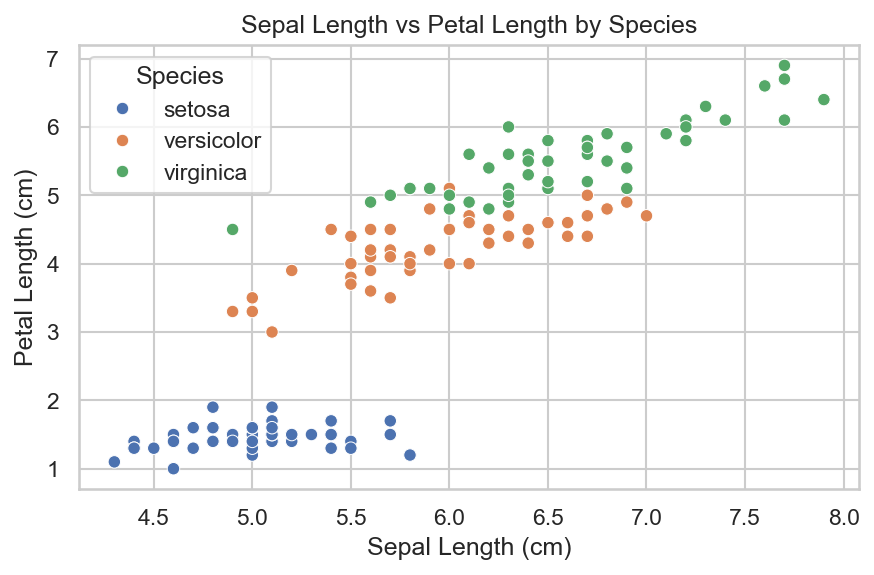

# Iris Dataset - Exploratory Data Analysis

This repository contains a small exploratory analysis of the classic [Iris dataset](https://archive.ics.uci.edu/ml/datasets/iris) using **Python**, **pandas**, **matplotlib**, and **seaborn**.  
The project focuses on a reproducible, script-based workflow (no Jupyter required).

## Quick Preview

Example scatter plot generated by the script:



## Project Structure

- `iris_analysis.py` → Python script: load dataset, run basic analysis and (optionally) export plots
- `iris_analysis.ipynb` → Colab notebook with interactive exploration and visualizations
- `images/` → Sample visualization images (committed for preview)
- `requirements.txt` → Python dependencies
- `README.md` → Project documentation

## Requirements

Create a virtual environment and install dependencies:

```bash
python -m venv venv
# Windows PowerShell
venv\Scripts\Activate.ps1
# Linux / macOS
# source venv/bin/activate

pip install -r requirements.txt
```

## How to Run

### Run the analysis script (prints dataset information and summary to console):
```bash
python iris_analysis.py
```

### Generate and save example plots to `images/`:
```bash
python iris_analysis.py --save-figs
```

## Analysis Performed

- Dataset information and missing-value checks
- Descriptive statistics: (`df.describe()`)
- Group-by species: mean measurements per class
- Visualizations:
  - Line chart: Sepal length and width trends
  - Bar chart: Average petal length by species
  - Histogram: Distribution of petal width
  - Scatter plot: Sepal length vs petal length (colored by species)

## Insights

- _Setosa_ has significantly smaller petal length and width compared to other species
- _Virginica_ generally shows the largest values across features
- No missing values were detected; the dataset is clean and consistent

## License

This project is distributed under the MIT License. See [LICENSE](LICENSE).

## About the Author

- **Name**:  Augusto Mate  
- **E-mail**:  mate.augusto.mz@gmail.com

---

> Version **1.0.0** has been released! See the [release page](https://github.com/software-development-course-2025/python-week-7-assignment/releases/tag/v1.0.0) for full details.
